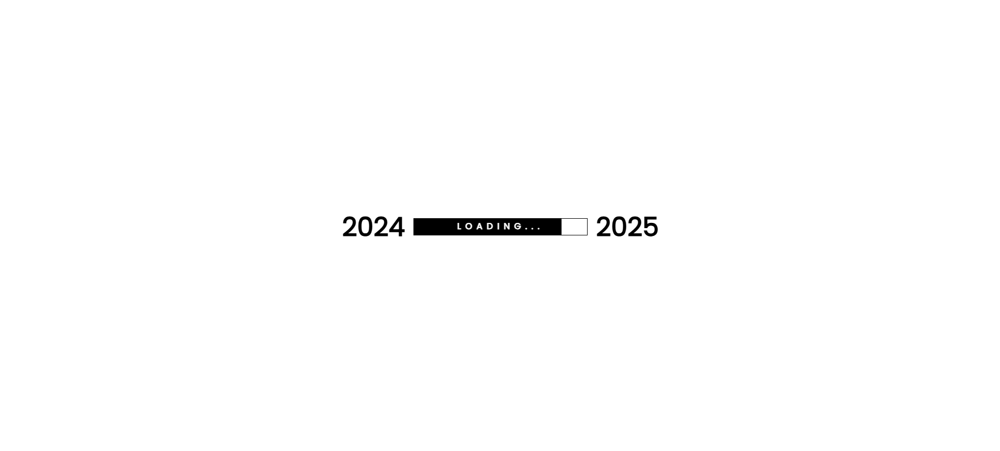
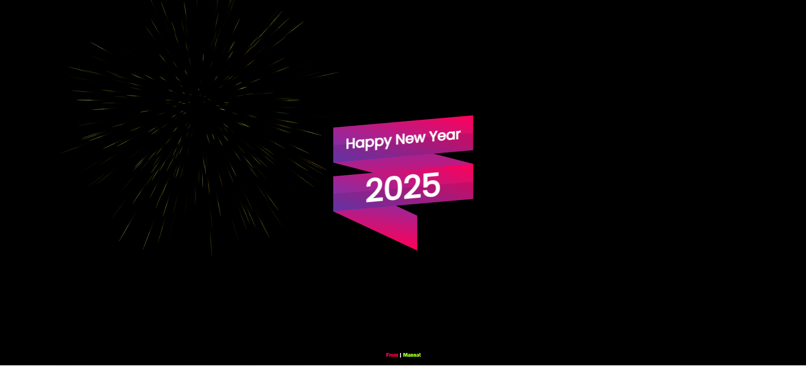

# New Year Wish

## Description
A dynamic fireworks animation project that brings festive cheer and vibrant visual effects. Users can interact with the canvas to trigger fireworks, creating an immersive and visually engaging experience.

## Features
- Beautiful, colorful fireworks animation.
- Interactive firework launching with mouse events.
- Trail effects for fireworks and particles.
- Automatic firework launches with configurable delay.

## How It Works
1. Open the provided HTML file in any modern web browser.
2. Enjoy the fireworks display, which reacts to mouse movements and clicks.
3. Fireworks are launched both automatically and manually based on mouse interaction.

## Screenshots

### How it looks at start before the fireworks display

### How it looks when the fireworks begin and display vibrant colors

## Benefits
- Provides an engaging visual experience.
- Creates a festive atmosphere, perfect for celebrations like New Year's Eve.
- Enhances user engagement with interactive fireworks.

## Future Scope
- Add more interactive elements like sound effects or background music.
- Implement mobile responsiveness for a seamless experience on all devices.
- Enhance customization options for users to adjust fireworks display settings.

## Contribution
- Feel free to contribute by improving animation effects, optimizing performance, or adding new features.
- Fork this repository and submit pull requests to enhance the project.